#  NDWI-Based Waterbody Detection & K-Means Clustering

This project analyzes satellite images to **detect and cluster waterbodies** using the **Normalized Difference Water Index (NDWI)** and **K-Means clustering**.  
It allows users to mask non-water pixels based on a NDWI threshold, and then cluster the remaining water pixels to study intra-waterbody variations.

---

##  Project Overview

The pipeline performs the following steps:

1. **Band Detection & Reading**
   - Automatically locates required spectral bands (`Blue`, `Green`, `Red`, `NIR`) for **Landsat-8/9** or **Sentinel-2** imagery.
   - Supports both `.TIF` and `.jp2` formats.

2. **NDWI Computation**
   - Computes NDWI using the formula: `NDWI = (Green - NIR) / (Green + NIR)`
   - Handles nodata pixels and scales NDWI between -1 and 1.

3. **Threshold-Based Masking**
   - Masks non-water pixels using a **user-specified NDWI threshold**.
   - Segregates image into:
     - Water regions (NDWI > threshold)
     - Non-water regions (NDWI ≤ threshold)

4. **Visualization**
   - Generates RGB previews, NDWI maps, and water/non-water separation visualizations.

5. **NDWI Analysis**
   - Computes NDWI statistics (mean, median, std, min, max).
   - Automatically determines the **Otsu threshold** for comparison.
   - Estimates **water and non-water area** in km².
   - Saves outputs as CSV and histogram plots.

6. **K-Means Clustering**
   - Clusters water pixels (NDWI > threshold) into **K user-defined clusters**.
   - Produces a color-coded **cluster map**.
   - Performs cluster-wise NDWI statistical analysis.
   - Saves cluster summaries and area distribution plots.

7. **Elbow Method**
   - Finds optimal K value for K-Means clustering using **WCSS-based elbow detection**.

---

##  Project Structure

```
📁 NDWI-Waterbody-Clustering/
│
├── 📄 main.py                # Main driver script for NDWI + K-Means analysis
├── 📄 app.py                 # Streamlit web app for interactive visualization
├── 📄 config.py              # Configuration file (paths, thresholds, band settings)
│
├── 📄 utils.py               # Utility functions (find, read, stretch bands)
├── 📄 ndwi_module.py         # NDWI computation & water masking
├── 📄 ndwi_analysis.py       # NDWI visualization, Otsu thresholding & stats
├── 📄 kmeans_module.py       # Custom K-Means implementation & elbow method
├── 📄cluster_analysis.py     # Cluster building, visualization & analysis
│
├── 📁 Sentinel_data/         # Sentinel-2 image folder
├── 📁 Landsat_data/          # Landsat image folder
├── 📁 Landsat_output/ 
├── 📁 Sentinel_output/       # Output folder (NDWI maps, clusters, CSVs)
│
└── 📄 README.md              # Project documentation
```

---

##  Running the Project

###  1. Using the Python Script
```bash
python main.py
```

This script will:
- Read band files (auto-detects Sentinel or Landsat paths from `config.py`)
- Compute NDWI and mask non-water areas
- Cluster water pixels using K-Means
- Save all analysis outputs under `OUTPUT_DIR`

###  2. Using the Streamlit App
```bash
streamlit run app.py
```

Then open the browser UI to:
- Upload satellite bands (`Green`, `NIR`, optional `Blue`/`Red`)
- Choose satellite type (Landsat or Sentinel-2)
- Set NDWI threshold and K value
- View visualizations, histograms, and clustering interactively

---

##  Key Parameters (from `config.py`)

| Parameter | Description | Example |
|------------|-------------|----------|
| `SENT_DIR` | Sentinel image directory | `"Sentilen_data"` |
| `LANDSAT_DIR` | Landsat image directory | `"Landsat_data"` |
| `OUTPUT_DIR` | Output directory for all results | `"Sentinel_output" / "Landsat_output"` |
| `NDWI_THRESHOLD` | NDWI cutoff for masking | `0.0` |
| `N_CLUSTERS` | Number of clusters for K-Means | `3` |
| `PIXEL_SIZE` | Pixel resolution (m) | `10` or `30` |
| `DOWNSAMPLE` | Image downsampling factor | `4` |
| `k_max` | Max K for elbow analysis | `10` |

---

##  Outputs for Sentinel

| Output Type | Description | Example |
|--------------|-------------|----------|
| **Original RGB Image** | Original RGB composite | 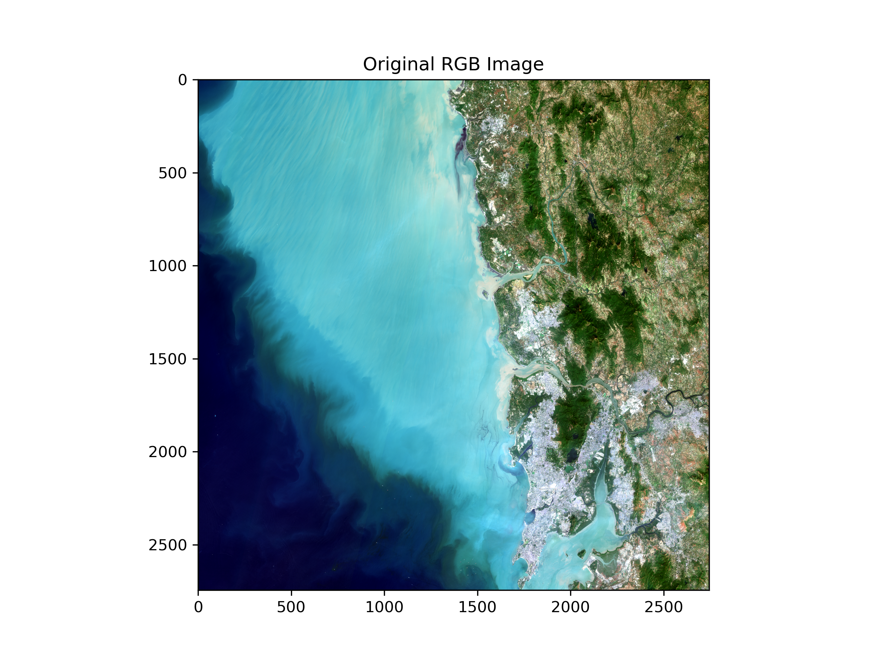 |
| **NDWI Map** | NDWI values visualized to identify potential water regions | 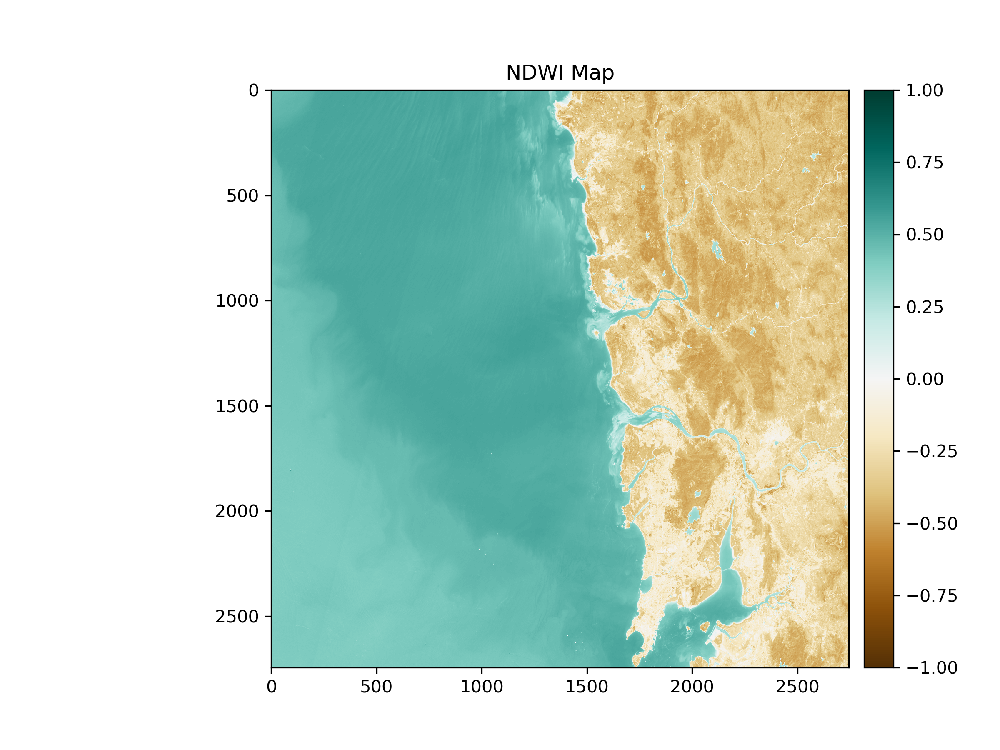 |
| **Water vs Non-Water Mask** | Separation of water pixels based on threshold | 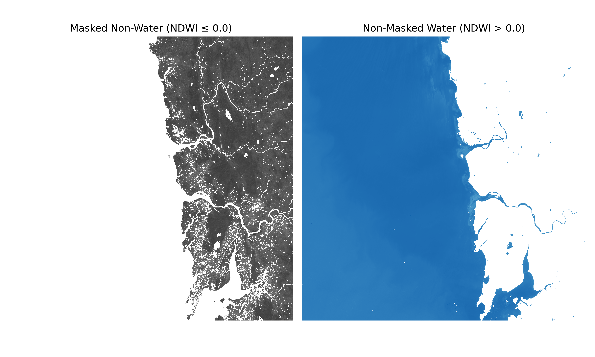 |
| **Histogram of NDWI** | NDWI pixel value distribution | 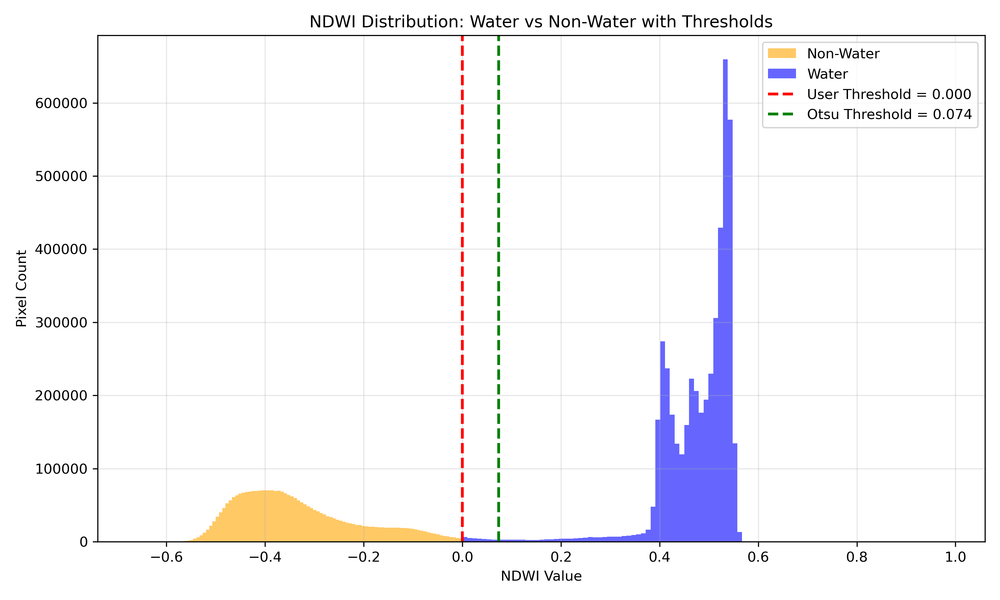 |
| **Clustered Waterbody Map** | K-Means clustering result on water pixels | 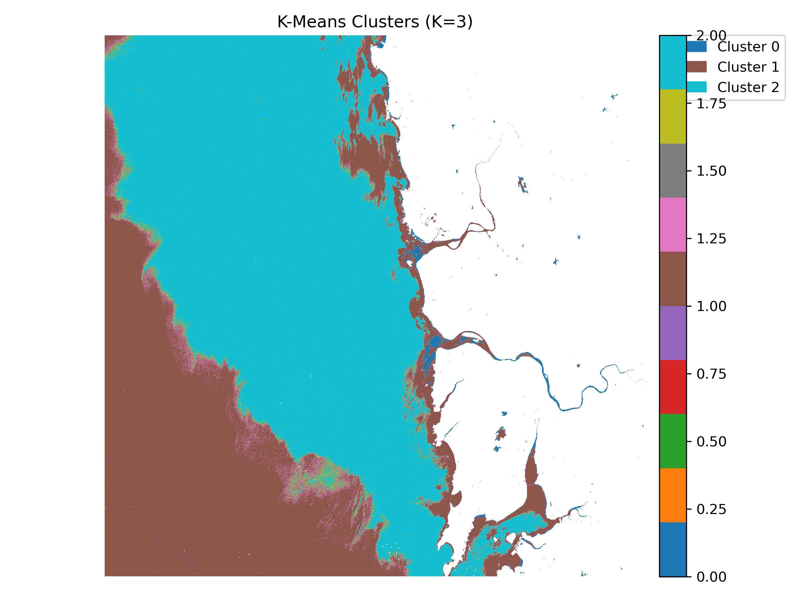 |
| **Cluster Area Distribution** | Cluster-wise area coverage pie chart | 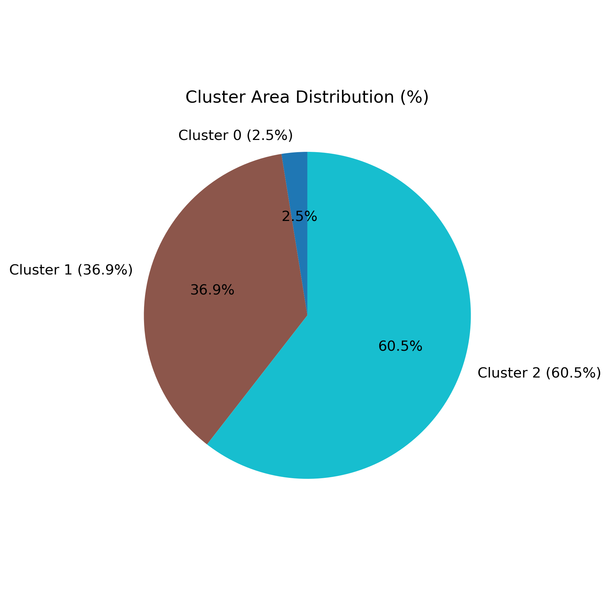 |
| **Elbow Plot** | Optimal K detection via WCSS curve | 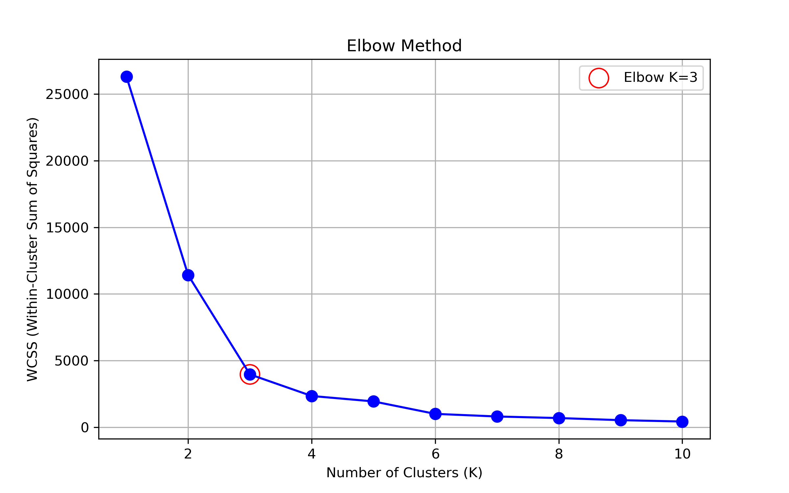 |


##  Outputs for Landsat

| Output Type | Description | Example |
|--------------|-------------|----------|
| **Original RGB Image** | Original RGB composite | 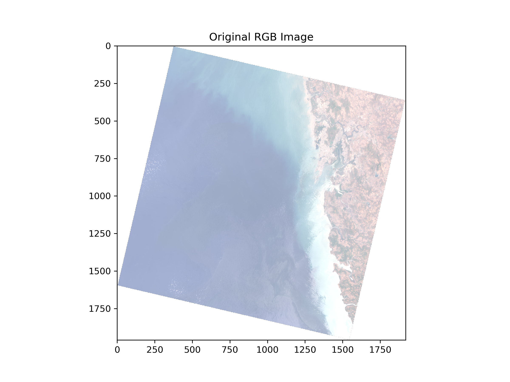 |
| **NDWI Map** | NDWI values visualized to identify potential water regions | 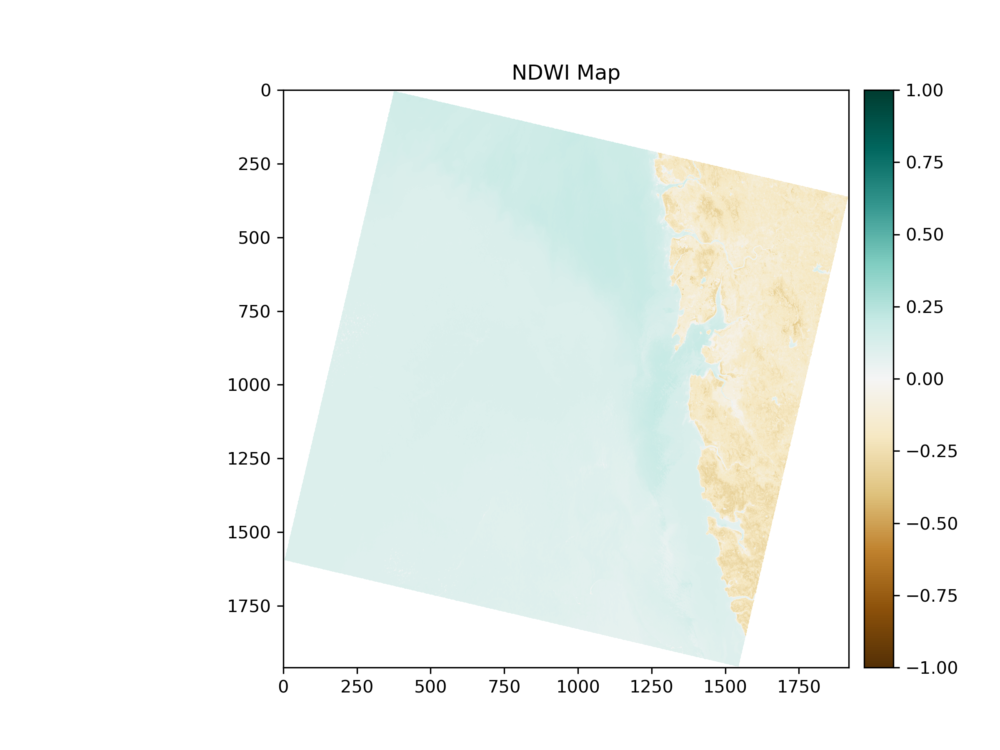 |
| **Water vs Non-Water Mask** | Separation of water pixels based on threshold | 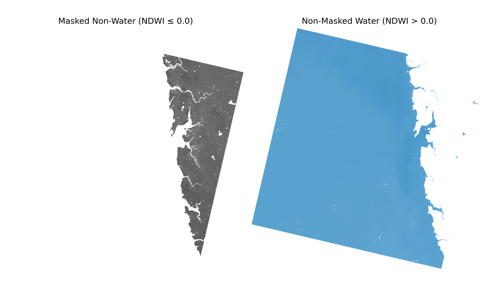 |
| **Histogram of NDWI** | NDWI pixel value distribution | 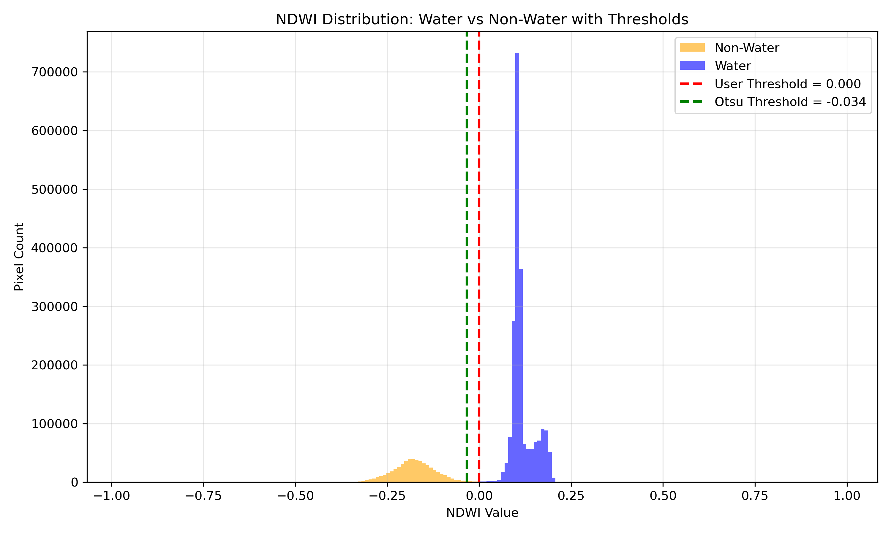 |
| **Clustered Waterbody Map** | K-Means clustering result on water pixels | 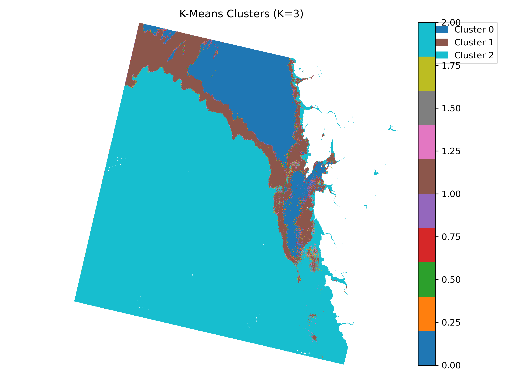 |
| **Cluster Area Distribution** | Cluster-wise area coverage pie chart | 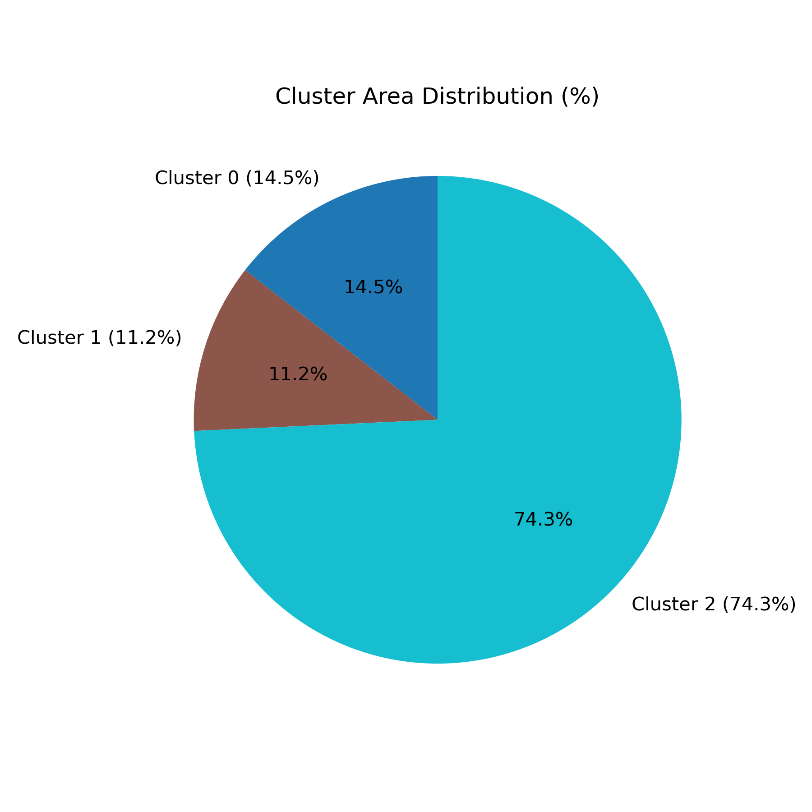 |
| **Elbow Plot** | Optimal K detection via WCSS curve | 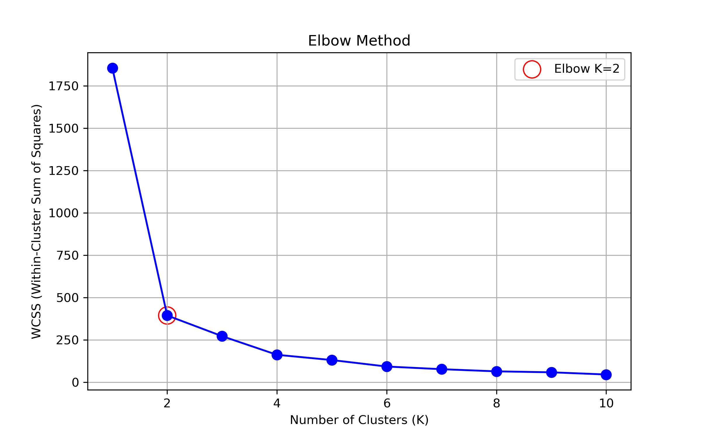 |

---


##  Dependencies

Install dependencies via:
```bash
pip install requirements.txt
```

---

##  Example Workflow

1. Place Sentinel or Landsat bands inside `Sentinel_data` or `Landsat_data` folder.
2. Adjust `config.py` (e.g., pixel size, NDWI threshold).
3. Run `main.py` or launch Streamlit via `app.py`.
4. Check results inside the specified `OUTPUT_DIR`.

---

